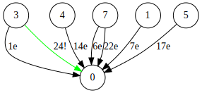

<<<
== The farmer, the wolf, the goat and the cabbage

[quote, https://en.wikipedia.org/wiki/Wolf,_goat_and_cabbage_problem]
____
Once upon a time a farmer went to a market and purchased a wolf, a goat, and a cabbage. On his way home, the farmer came to the bank of a river and rented a boat. But crossing the river by boat, the farmer could carry only himself and a single one of his purchases: the wolf, the goat, or the cabbage.
If left unattended together, the wolf would eat the goat, or the goat would eat the cabbage.
The farmer's challenge was to carry himself and his purchases to the far bank of the river, leaving each purchase intact. How did he do it?
____

Joshua describes a problem as the combination of an initial **state** and a desired **effect**. Finding the solution of a problem means answering the question: is there at least one **chain of concatenated events** that eventually cause the desired effect?**

An event is something like a phisycal phenomena or an action, that can occur under certain _conditions_. For example, "The farmer brings the cabbage on the bank B of the river" can occur if both farmer and cabbage are on the bank A of the river. Conditions come form a **state**.

The state is a set of **variables** that over the time determine the **conditions** that allow events to occur, as well as the occurrence of events change the state. 

Eventually, the definition of an event includes:

* a unique description
* an _optional_ list of conditions
* an _optional_ list of assignments
* an _optional_ list of effects

Techically, an **effect** is just an event. Althought, an effect assumes a **cause-effect relationship** with another event.

Joshua recognizes three types of cause-effect relationships depending on their **weight**: 

* a weight of 0 means that the cause **never** triggers the effect
* a weight of 1 means that the cause **always** triggers the effect
* any weight into (0,1) means that the cause _may_ trigger the effect

You can see the weight as the probability that the cause can trigger the effect.

For example: the event "The farmer brings the cabbage on the bank B of the river" _may_ cause the effect "The farmer, the wolf, the goat and the cabbage are on the bank B of the river", therefore the weight of such relationship must be into the interval of (0,1).

You can see the weight as the probability that a casue-effect relationship can occur, though when the weight is into the interval (0,1), it is to necessary to specify a precise probability.

Back to the concept of state and thinking of Farmer's problem, we may define 8 variables in order to determine, over the time, if the characters are on the river's bank A (value 1) or not (value 0):

* FarmerA   = 1
* WolfA     = 1
* GoatA     = 1
* CabbageA  = 1
* FarmerB   = 0
* WolfB     = 0 
* GoatB     = 0
* CabbageB  = 0

Given the defined variable, below a complete definition of one event.

[cols="2,4"] 
.The definition of an event
|===

|Event
|"The farmer brings the cabbage on the bank B of the river"

|Conditions
|
++++
FarmerA == 1
CabbageA == 1
((WolfA < 1) && (GoatA == 1)) || ((WolfA == 1) && (GoatA < 1))
++++

|Effect
|"The farmer, the wolf, the goat and the cabbage are on the bank B of the river" with weight 0.5

|Assignments
a|
++++
FarmerB = 1
CabbageB = 1
FarmerA = 0
CabbageA = 0
++++

|===

The **assignments** express the consequences of an event's occurrence. For example, if the event "The farmer brings the cabbage on the bank B of the river" happened, then state must change accordingly.

[NOTE]
====
A set of well known events and cause-effect relationships forms the base knowledge used by Joshua to solve a **problem**. 
Even if solving problems may increase the knowledge, Joshua is not able (or not deisgned to) to build up the knonledge from scratch, since it requires the ability to observe and understand the occurrence of not known events, in order to classify them and deriving new cause-effect relationships.
====

Starting from a base knowledge, solving the Farmer's problem means understanding what chains of concatenated cause-effect relationships brings to the final effect "The farmer, the wolf, the goat and the cabbage are on the bank B of the river".

[NOTE]
====
For Joshua, **solving a problem** means understanding if a desired event can occur alone or as the final effect of a chain of concatenated cause-effect relationships. 
====

Being able to describe a problem is everything, nevertheless it can be tricky, since the description has to be limited to declare the facts (events, relationships and state), **without falling into the desire of anticipating the reasoning**.

Describing a problem involves few important steps:

. Identifying the event that represent the solution
. Identifying all others relevant events
. Identifying the cause-effect relationships between events
. Identifying conditions and assignments for each event

Here the events of the Farmer's problem:

* The farmer, the wolf, the goat and the cabbage are on the bank B of the river (**solution**)
* The farmer brings the cabbage on the bank B of the river
* The farmer brings the cabbage on the bank A of the river
* The farmer brings the goat on the bank B of the river
* The farmer brings the goat on the bank A of the river
* The farmer brings the wolf on the bank B of the river
* The farmer brings the wolf on the bank A of the river
* The farmer goes to the bank A of the river
* The farmer goes to the bank B of the river

All events, _except the solution_, are the actions the Farmer can do, and all of them may cause the solution.
Why all? The answer can be tricky, from the perspective of not anticipating any reasoning to Joshua. Indeed one may think that the event/action "The farmer goes to the bank A of the river" cannot be the cause of the solution, but that's true only if the solution require strictly one **one** event/action (that is a chain of only one cause-effect relationships).

Since the Farmer may require (we know he must require) a sequence of actions to solve the problem, then each of his action can be a step toward the solution.

Below a complete definition of events and relationships of the Farmer's problem, in the form (YAML file footnote:[Cfr. https://en.wikipedia.org/wiki/YAML]) used by Joshua to define a base knowledge.

[source, yaml]
----
  knowlegde:
    - id: "The farmer, the wolf, the goat and the cabbage are on the bank B of the river"
      conditions:
        - FarmerB == 1
        - WolfB == 1
        - GoatB == 1
        - CabbageB == 1

    - id: The farmer brings the cabbage on the bank B of the river
      conditions:
        - FarmerA == 1
        - CabbageA == 1
        - ((WolfA < 1) && (GoatA == 1)) || ((WolfA == 1) && (GoatA < 1))
      effects:
        - weight: 0.5
          event: "The farmer, the wolf, the goat and the cabbage are on the bank B of the river"
      assignments:
        - FarmerB = 1
        - CabbageB = 1
        - FarmerA = 0
        - CabbageA = 0

    - id: "The farmer brings the cabbage on the bank A of the river"
      conditions:
        - FarmerB == 1
        - CabbageB == 1
        - ((WolfB < 1) && (GoatB == 1)) || ((WolfB == 1) && (GoatB < 1))
      effects:
        - weight: 0.1
          event: "The farmer, the wolf, the goat and the cabbage are on the bank B of the river"
      assignments:
        - FarmerA = 1
        - CabbageA = 1
        - FarmerB = 0
        - CabbageB = 0
    
    - id: "The farmer brings the goat on the bank B of the river"
      conditions:
        - FarmerA == 1
        - GoatA == 1
      effects:
        - weight: 0.5
          event: "The farmer, the wolf, the goat and the cabbage are on the bank B of the river"
      assignments:
        - FarmerB = 1
        - GoatB = 1
        - FarmerA = 0
        - GoatA = 0

    - id: "The farmer brings the goat on the bank A of the river"
      conditions:
        - FarmerB == 1
        - GoatB == 1
      effects:
        - weight: 0.1
          event: "The farmer, the wolf, the goat and the cabbage are on the bank B of the river"
      assignments:
        - FarmerA = 1
        - GoatA = 1
        - FarmerB = 0
        - GoatB = 0

    - id: "The farmer brings the wolf on the bank B of the river"
      conditions:
        - FarmerA == 1
        - WolfA == 1
        - ((CabbageA < 1) && (GoatA == 1)) || ((CabbageA == 1) && (GoatA < 1))
      effects:
        - weight: 0.5
          event: "The farmer, the wolf, the goat and the cabbage are on the bank B of the river"
      assignments:
        - FarmerB = 1
        - WolfB = 1
        - FarmerA = 0
        - WolfA = 0

    - id: "The farmer brings the wolf on the bank A of the river"
      conditions:
        - FarmerB == 1
        - WolfB == 1
        - ((CabbageB < 1) && (GoatB == 1)) || (CabbageB == 1) && (GoatB < 1))
      effects:
        - weight: 0.1
          event: "The farmer, the wolf, the goat and the cabbage are on the bank B of the river"
      assignments:
        - FarmerA = 1
        - WolfA = 1
        - FarmerB = 0
        - WolfB = 0

    - id: "The farmer goes to the bank A of the river"
      conditions:
        - FarmerB == 1
        - WolfB == 1 || CabbageA == 1 || GoatA == 1
        - CabbageB == 1 || WolfA == 1 || GoatA == 1
        - WolfA == 1 || CabbageA == 1 || GoatA == 1
      effects:
        - weight: 0.3
          event: "The farmer, the wolf, the goat and the cabbage are on the bank B of the river"
      assignments:
        - FarmerA = 1
        - FarmerB = 0
    
    - id: "The farmer goes to the bank B of the river"
      conditions:
        - FarmerA == 1
        - WolfA == 1 || CabbageB == 1 || GoatB == 1
        - CabbageA == 1 || WolfB == 1 || GoatB == 1
        - WolfB == 1 || CabbageB == 1 || GoatB == 1
      effects:
        - weight: 0.5
          event: "The farmer, the wolf, the goat and the cabbage are on the bank B of the river"
      assignments:
        - FarmerB = 1
        - FarmerA = 0
----

All conditions of the events only arise from the problem's facts. For example the event "The farmer brings the cabbage on the bank B of the river" can happen only if:

* Farmer and cabbage are on the bank A of the river (obvious consideration)
* Wolf and goat are not alone in the same place (the wolf would eat the goat)

Likewise, the assignments are the simple adaptions of the state.

[NOTE]
====
The proposed knowledge for the Farmer's problem is based on the idea "if you do not know what to do, any move can lead to the solution", Such approach is a **brutal force attack** to the problem, and a natural consequence of having many events that **may** cause the solution.
====

Joshua requires 24 cycles to solve the problem, most of them are foolish attempts.

[source, yaml]
----
joshua.exe solve -k ..\resources\k_contadino.yml -p ..\resources\p_contadino.yml 
Max cycles:  100
State contains:  8  variables
        Outcome|   true|
         Cycles|     24|
   Queue's size|     31|
----

Starting from the desired effect, Joshua identifies all possible chain of concatenated events that may cause the solution. Joshua tries each chain, until the solution is reached.

[cols="1,4,4,3,4", options="header"] 
.All attempts made by Joshua to solve the Farmer's problem.
|===

|Step
|Event
|Outcome
|State changed?
|Effects

|0
|The farmer brings the cabbage on the bank B of the river
|No conditions
|False
|None

|1
|The farmer brings the goat on the bank B of the river
|It happened
|True
|None

|2
|The farmer brings the wolf on the bank B of the river
|No conditions
|False
|None

|3
|The farmer goes to the bank B of the river
|No conditions
|False
|None

|4
|The farmer brings the cabbage on the bank B of the river
|No conditions
|False
|None

|5
|The farmer brings the goat on the bank B of the river
|No conditions
|False
|None

|6
|The farmer goes to the bank A of the river
|It happened
|True
|None

|7
|The farmer brings the cabbage on the bank B of the river
|It happened
|True
|None

|8
|The farmer brings the goat on the bank B of the river
|No conditions
|False
|None

|9
|The farmer brings the wolf on the bank B of the river
|No conditions
|False
|None

|10
|The farmer goes to the bank B of the river
|No conditions
|False
|None

|11
|The farmer brings the cabbage on the bank B of the river
|No conditions
|False
|None

|12
|The farmer goes to the bank A of the river
|No conditions
|False
|None

|13
|The farmer brings the cabbage on the bank A of the river
|The event could have happened, but caused a cycle
|The event could have changed the state
|None

|14
|The farmer brings the goat on the bank A of the river
|It happened
|True
|None

|15
|The farmer brings the cabbage on the bank B of the river
|No conditions
|False
|None

|16
|The farmer brings the goat on the bank B of the river
|The event could have happened, but caused a cycle
|The event could have changed the state
|None

|17
|The farmer brings the wolf on the bank B of the river
|It happened
|True
|None

|18
|The farmer goes to the bank B of the river
|No conditions
|False
|None

|19
|The farmer brings the cabbage on the bank B of the river
|No conditions
|False
|None

|20
|The farmer brings the goat on the bank B of the river
|No conditions
|False
|None

|21
|The farmer brings the wolf on the bank B of the river
|No conditions
|False
|None

|22
|The farmer goes to the bank A of the river
|It happened
|True
|None

|23
|The farmer brings the cabbage on the bank B of the river
|No conditions
|False
|None

|24
|The farmer brings the goat on the bank B of the river
|It happened
|True
|The farmer, the wolf, the goat and the cabbage are on the bank B of the river

|===

The brutal force attack is recognizable by all attempts to check a cause-effect relationship, where the **cause** event does not have the necessary conditions to occur, as in the case of the third attempt (cycle 2).
Indeed, at the second attempt (cycle 1) Joshua checked the event "The farmer brings the wolf on the bank B of the river", the latter happened and changed the state (the Farmer and the wolf are on the bank B now), even if the effect (the solution) dit not occur. Therefore the third attempt can be seen as foolish, because Joshua checked the event "The farmer brings the wolf on the bank B of the river", that is impossible because the Farmer is already on the river B.

Note that the same event can occur multiple times along the sequence of attempts made by Joshua. The reason lies in the Joshua's way of thinking. An attempt is a single chain of events, and if one chain failed to occur then Joshua forget it. Nevertheless, if at least one event of a chain occurred and the state is changed, then Joshua rehabilitates the previous checked chains.

Steps 13 and 16 highlight how Joshua reasons too. Even if those events could have happened, Joshua discarded them because they would have changed the current state into a configuration already reached in the past. Joshua considered the happening of those events a potential loop.

If you removed all failed attempts from the table, what remains are the steps toward the solution.

[cols="1,4,4", options="header"] 
."The farmer, the wolf, the goat and the cabbage"
|===

|Step
|Cause
|effect

|1
|The farmer brings the goat on the bank B of the river
|The state changed

|6
|The farmer goes to the bank A of the river
|The state changed

|7
|The farmer brings the cabbage on the bank B of the river
|The state changed

|14
|The farmer brings the goat on the bank A of the river
|The state changed

|17
|The farmer brings the wolf on the bank B of the river
|The state changed

|22
|The farmer goes to the bank A of the river
|The state changed

|24
|The farmer brings the goat on the bank B of the river
|The farmer, the wolf, the goat and the cabbage are on the bank B of the river

|===

The nature of the approach visibly arise looking at the below diagram, that shows the occurrence of the cause-effect relationships. 

To simplify the diagram, the events have been numbered:

* 0 - "The farmer, the wolf, the goat and the cabbage are on the bank B of the river" (**solution**)
* 1 - "The farmer brings the cabbage on the bank B of the river"
* 3 - "The farmer brings the goat on the bank B of the river"
* 4 - "The farmer brings the goat on the bank A of the river"
* 5 - "The farmer brings the wolf on the bank B of the river"
* 7 - "The farmer goes to the bank A of the river"

The diagram shows 5 different chains of concatenated event, each one containing only one cause-effect relationship. To derive the sequence of attempts, you have to watch the number of cycle associated to each arrow:

* cycle 1  - "The farmer brings the goat on the bank B of the river" occurred, but not the solution
* cycle 6  - "The farmer goes to the bank A of the river" occurred, but not the solution
* cycle 7  - "The farmer brings the cabbage on the bank B of the river" occurred, but not the solution
* cycle 14 - "The farmer brings the goat on the bank A of the river" occurred, but not the solution
* cycle 17 - "The farmer brings the wolf on the bank B of the river" occurred, but not the solution
* cycle 22 - "The farmer goes to the bank A of the river" occurred, but not the solution
* cycle 24 - "The farmer brings the goat on the bank A of the river" occurred, as well as the solution!

Even if the occurrence of the chains dit not cause the solution, they changes the state util eventually the last chain cause the solution.