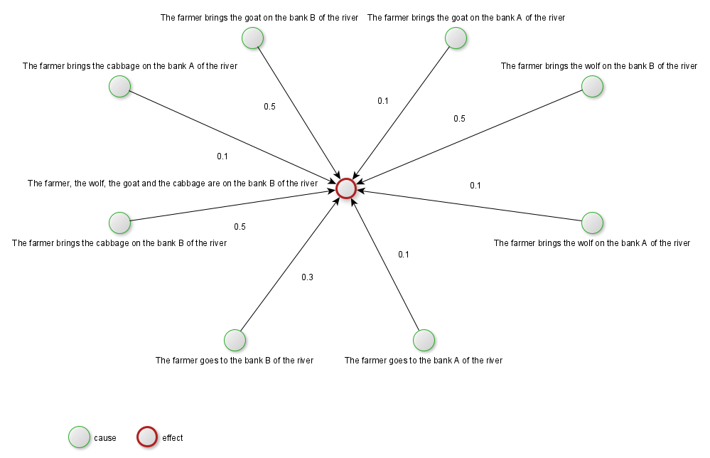

== How Joshua reasons

From Joshua's perspective, reasoning means understanding if one event (the solution of a problem) can be the final effect of a chain of occurrences of cause-effect relationships. To verify the existance of such type of chain, Joshue leverage on a predefined knowledge and a state.

A knowledge includes a set of events, and a set of cause-effect relationships.
A state is just a set of variables.

Even if Joshua is able to increase the knowledge deriving new cause-effect relationships, it needs a starting knowledge, since is not able to build one from scratch. Building a knowledge requires the ability to observe (by senses) and analyze (by reasoning) events, in order to produce new cause-effect relationships.

=== Events

An event is a phenomenon which can always happen or it can happen under certain circumstances. Technically, an event is defined by:

* a human readable description of the event itself
* an **optional** list of condition, where each condition is a mathematical equation
* an **optional** list of assignments, where each assigment change the value of a specific variable

=== Cause-effect relationships

A cause-effect relationship ties two events, defining that the happening of one event (cause) "may" trigger the happening of another one.

For Joshua there are two different type of relationships:

* **always true relationships** declares that the happening of event X **always** trigger the happening of event Y
* **possible relationship** declares that the happening of event X **may** trigger the happening of event Y

Thus every relationship has a weight, and the latter is a number into the interval [0,1] such that:

* 0 means that the event X **never** triggers the event Y
* 1 means that the event X **always** triggers the event Y
* any value in (0,1) means that the event X **may** trigger the event Y

=== State

The state is a set of variables, whose values can determine if an event can happen, as well as the values can be altered by the occurrence of events.

Managing a state is important to solve some type of problems, where the solution is determinated by reaching specific values of some variables.

=== Solving problems

When Joshua loads a knowledge file and transforms it into a directed, weighted graph, where events are the nodes and relationships are the arcs. 

[NOTE]
====
Givan a graph, solving a problems means asking the question: **is there a concatenation of cause-effect relationships that terminate into the desidered effect?**
====

When a problem is only related to "always true relationships", then finding out a solution means finding out a path between a cause and an effect into the knowledge's graph. In this case, we say that Joshua is operating like a "rules manager".

Differently, when the occurrence of events are bound to a specific state, then the reasoning is harder. Joshua treats the graph as a kind of state machine, the path from the source event to the desired effect can be really long, and the same cause-effect relationship may occur multiple times.

=== Be able to describe the problem

An effective description of the problem is everything (Joshua is not able to do that by itself).

Looking from Joshua's eyes, describing a problems involves an iterative process of four steps:

. Which event represents the problem's solution?
. Which others events are possible?
. Which cause-effect relationship has the problem's solution as effect?
. Which others relationships are possible?

If some events can occur only if a specific state is reached, then it is necessary to define the state too.

Next paragraph explain the process of describing a problem throughout an example.

<<<
=== The farmer, the wolf, the goat and the cabbage

[quote, https://en.wikipedia.org/wiki/Wolf,_goat_and_cabbage_problem]
____
Once upon a time a farmer went to a market and purchased a wolf, a goat, and a cabbage. On his way home, the farmer came to the bank of a river and rented a boat. But crossing the river by boat, the farmer could carry only himself and a single one of his purchases: the wolf, the goat, or the cabbage.
If left unattended together, the wolf would eat the goat, or the goat would eat the cabbage.
The farmer's challenge was to carry himself and his purchases to the far bank of the river, leaving each purchase intact. How did he do it?
____

Here a problem you solve by attempts until you find out the solution, a kind of brutal force approac. Joshua approaches this kind of problems in the same way, throughout an iterative application of well-known rulesm, and there is no learning in terms of knowledge expansion.

The first step of problem's description is defining the solution's event:

. The farmer, the wolf, the goat and the cabbage are on the bank B of the river

Other possible events are:

* The farmer brings the cabbage on the bank B of the river
* The farmer brings the cabbage on the bank A of the river
* The farmer brings the goat on the bank B of the river
* The farmer brings the goat on the bank A of the river
* The farmer brings the wolf on the bank B of the river
* The farmer brings the wolf on the bank A of the river
* The farmer goes to the bank A of the river
* The farmer goes to the bank B of the river

Now e have the events, we can have the cause-effect relationships.

[cols="2,2,1", options="header"] 
.Cause-effect relationships
|===

|Cause
|Effect
|Weight

|The farmer brings the cabbage on the bank B of the river
|The farmer, the wolf, the goat and the cabbage are on the bank B of the river
|0.5

|The farmer brings the goat on the bank B of the river
|The farmer, the wolf, the goat and the cabbage are on the bank B of the river
|0.5

|The farmer brings the wolf on the bank B of the river
|The farmer, the wolf, the goat and the cabbage are on the bank B of the river
|0.5

|The farmer brings the cabbage on the bank A of the river
|The farmer, the wolf, the goat and the cabbage are on the bank B of the river
|0.1

|The farmer brings the goat on the bank A of the river
|The farmer, the wolf, the goat and the cabbage are on the bank B of the river
|0.1

|The farmer brings the wolf on the bank A of the river
|The farmer, the wolf, the goat and the cabbage are on the bank B of the river
|0.1

The farmer goes to the bank A of the river
|The farmer, the wolf, the goat and the cabbage are on the bank B of the river
|0.3

The farmer goes to the bank B of the river
|The farmer, the wolf, the goat and the cabbage are on the bank B of the river
|0.5

|===

Having defined the problem in this way, the resulting knowledge's graph include several "possible" cause-effect relationships, all of them with the same effect (the problem's solution event).

[NOTE]
====
The weights only affect how joshua gives precedence to relationships, when he has to choose from a plurality of "possible" relationships. Therefore if all weights were randomly chosen from the interval (0,1), Joshua would reach the solution anyway (maybe slower, maybe faster).
====

You can easily see that the events can occur only if a specific state is reached. Indeed, the event "The farmer brings the cabbage on the bank B of the river" can only happen if the farmer and the cabbage are on the bank A of the river, such type of condition comes from a state.

We define out state identifying 8 variables.

[NOTE]
====
The way we are describing the problem likely is not the only one possible. 
====

[cols="1,1,3", options="header"] 
.Variables of the state
|===

|Variable
|Initial value
|Meaning

|FarmerA
|1
|1 if the farmer is on river's bank A, 0 otherwise

|FarmerB
|0
|1 if the farmer is on river's bank B, 0 otherwise

|WolfA
|1
|1 if the wolf is on river's bank A, 0 otherwise

|WolfB
|0
|1 if the wolf is on river's bank B, 0 otherwise

|GoatA
|1
|1 if the goat is on river's bank A, 0 otherwise

|GoatB
|0
|1 if the goat is on river's bank B, 0 otherwise

|CabbageA
|1
|1 if the cabbage is on river's bank A, 0 otherwise

|CabbageB
|0
|1 if the cabbage is on river's bank B, 0 otherwise

|===

[NOTE]
====
The state may determine the conditions for an event to occur, as well as the occurrence of events may change the state.
====

Most of the defined events have conditions. For example, below the complete definition of the event "The farmer brings the cabbage on the bank B of the river". 

[cols="1,3", options="header"] 
.Definition of the event: "The farmer brings the cabbage on the bank B of the river"
|===

|Condition/assignment
|Expression

|Condition
|FarmerA == 1

|Condition
|CabbageA == 1

|Condition
|((WolfA == 0) && (GoatA == 1)) || ((WolfA == 1) && (GoatA == 0))

|Assignment
|FarmerB = 1

|Assignment
|FarmerA = 0

|Assignment
|CabbageA = 0

|Assignment
|CabbageB = 1

|===

Conditions of events arise from the problem's nature, thus the event "The farmer brings the cabbage on the bank B of the river" can happen only if:

* The farmer and the cabbage are on the bank A of the river
* The wolf and the g\oat are not in the same place (the wolk would eat the goat)

If the event "The farmer brings the cabbage on the bank B of the river" occurs, its assignments change the state accordingly (the farmer and the cabbage will be on the bank B of the river).

You may read the complete YAML files (knowledge and initial state) at the appendix.

=== Reasoning

Aking Joshua to find out the solution of the problem "The farmer, the wolf, the goat and the cabbage" produces 24 steps.

[cols="1,4,4,1,1", options="header"] 
.Solving "The farmer, the wolf, the goat and the cabbage"
|===

|Step
|Cause
|effect
|Outcome
|State changed?

|0
|The farmer brings the cabbage on the bank B of the river
|The farmer, the wolf, the goat and the cabbage are on the bank B of the river
|cause not happened
|false

|1
|The farmer brings the goat on the bank B of the river
|The farmer, the wolf, the goat and the cabbage are on the bank B of the river
|effect not happened
|true

|2
|The farmer brings the wolf on the bank B of the river
|The farmer, the wolf, the goat and the cabbage are on the bank B of the river
|cause not happened
|false

|3
|The farmer goes to the bank B of the river
|The farmer, the wolf, the goat and the cabbage are on the bank B of the river
|cause not happened
|false

|4
|The farmer brings the cabbage on the bank B of the river
|The farmer, the wolf, the goat and the cabbage are on the bank B of the river
|cause not happened
|false

|5
|The farmer brings the goat on the bank B of the river
|The farmer, the wolf, the goat and the cabbage are on the bank B of the river
|cause not happened
|false

|6
|The farmer goes to the bank A of the river
|The farmer, the wolf, the goat and the cabbage are on the bank B of the river
|effect not happened
|true

|7
|The farmer brings the cabbage on the bank B of the river
|The farmer, the wolf, the goat and the cabbage are on the bank B of the river
|effect not happened
|true

|8
|The farmer brings the goat on the bank B of the river
|The farmer, the wolf, the goat and the cabbage are on the bank B of the river
|cause not happened
|false

|9
|The farmer brings the wolf on the bank B of the river
|The farmer, the wolf, the goat and the cabbage are on the bank B of the river
|cause not happened
|false

|10
|The farmer goes to the bank B of the river
|The farmer, the wolf, the goat and the cabbage are on the bank B of the river
|cause not happened
|false

|11
|The farmer brings the cabbage on the bank B of the river
|The farmer, the wolf, the goat and the cabbage are on the bank B of the river
|cause not happened
|false

|12
|The farmer goes to the bank A of the river
|The farmer, the wolf, the goat and the cabbage are on the bank B of the river
|cause not happened
|false

|13
|The farmer brings the cabbage on the bank A of the river
|The farmer, the wolf, the goat and the cabbage are on the bank B of the river
|true but loop
|true

|14
|The farmer brings the goat on the bank A of the river
|The farmer, the wolf, the goat and the cabbage are on the bank B of the river
|effect not happened
|true

|15
|The farmer brings the cabbage on the bank B of the river
|The farmer, the wolf, the goat and the cabbage are on the bank B of the river
|cause not happened
|false

|16
|The farmer brings the goat on the bank B of the river
|The farmer, the wolf, the goat and the cabbage are on the bank B of the river
|true but loop
|true

|17
|The farmer brings the wolf on the bank B of the river
|The farmer, the wolf, the goat and the cabbage are on the bank B of the river
|effect not happened
|true

|18
|The farmer goes to the bank B of the river
|The farmer, the wolf, the goat and the cabbage are on the bank B of the river
|cause not happened
|false

|19
|The farmer brings the cabbage on the bank B of the river
|The farmer, the wolf, the goat and the cabbage are on the bank B of the river
|cause not happened
|false

|20
|The farmer brings the goat on the bank B of the river
|The farmer, the wolf, the goat and the cabbage are on the bank B of the river
|cause not happened
|false

|21
|The farmer brings the wolf on the bank B of the river
|The farmer, the wolf, the goat and the cabbage are on the bank B of the river
|cause not happened
|false

|22
|The farmer goes to the bank A of the river
|The farmer, the wolf, the goat and the cabbage are on the bank B of the river
|effect not happened
|true

|23
|The farmer brings the cabbage on the bank B of the river
|The farmer, the wolf, the goat and the cabbage are on the bank B of the river
|cause not happened
|false

|24
|The farmer brings the goat on the bank B of the river
|The farmer, the wolf, the goat and the cabbage are on the bank B of the river
|true
|true

|===  

Above table shows the cause-relationships that Joshua tried to reach the desired effect.

The brutal force approach is recognizable by all attempts with the outcome "cause not happened".
Indeed, the outcome "cause not happened" means that a cause-effect relationship cannot happen, since its cause cannot occur, usually because the cause requires a state that is not there. 
For example the very first attempt is the cause-effect "The farmer brings the cabbage on the bank B of the river", the latter cannot happen, because the farmer would left the wolf and the goat alone.

Differently, the outcome "effect not happened" means that the cause of the cause-effect relationship happened, but not the effect.
For example, at the cycle 1 the cause "The farmer brings the goat on the bank B of the river" occurred, but the effect (the problem's solution) did not yet (since the effect requires a specific state to occur).

If you clean the table of all foolish attempt, you have a clean path of cause-effect occurrences.

[cols="1,4,4,1,1", options="header"] 
.Solving "The farmer, the wolf, the goat and the cabbage"
|===

|Step
|Cause
|effect
|Outcome
|State changed?

|1
|The farmer brings the goat on the bank B of the river
|The farmer, the wolf, the goat and the cabbage are on the bank B of the river
|effect not happened
|true

|6
|The farmer goes to the bank A of the river
|The farmer, the wolf, the goat and the cabbage are on the bank B of the river
|effect not happened
|true

|7
|The farmer brings the cabbage on the bank B of the river
|The farmer, the wolf, the goat and the cabbage are on the bank B of the river
|effect not happened
|true

|14
|The farmer brings the goat on the bank A of the river
|The farmer, the wolf, the goat and the cabbage are on the bank B of the river
|effect not happened
|true

|17
|The farmer brings the wolf on the bank B of the river
|The farmer, the wolf, the goat and the cabbage are on the bank B of the river
|effect not happened
|true

|22
|The farmer goes to the bank A of the river
|The farmer, the wolf, the goat and the cabbage are on the bank B of the river
|effect not happened
|true

|24
|The farmer brings the goat on the bank B of the river
|The farmer, the wolf, the goat and the cabbage are on the bank B of the river
|true
|true

|===  